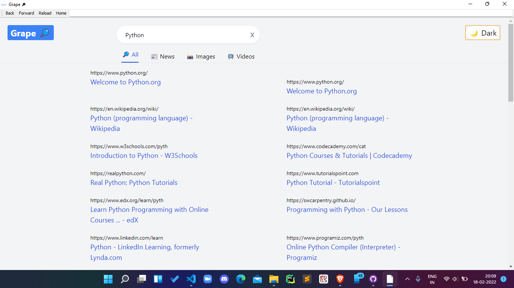

# Grape 🔎

A Web Browser made entirely in python.


## Search Engine 🔎




# Installation:
> For WIN / LINUX / MAC
 * Download the .zip file of code.
 * Extract it 📂.
 * Download/Install all the pre-requisites.
 * Run the ``splash.py`` file
 * And <b>BOOM!</b> you have it! sit back and <span style="color: green;">enjoy browsing!</span>

## Pre-requisites: 
  * PyQt5     ``$ pip install PyQt5``
  * PIL       ``$ pip install pillow``
  * PyQtWebEngine ```$ pip install PyQtWebEngine```

## Credits:
  > Akshat - ```Designing / Maintaining```
  
## INCREMENTS:
  * Fully private browser with its own search engine. 😉
     > which allows it to deal more effeciently
  * Doesn't store cache or any other kind of data. 📈
  * Less on memory high on performance. 🚀
  * Effecient usage of resources. 📈
  * UN-TRACKABLE!☢
  * Awesome animations!!

### All new Dark mode is here... give your eyes some rest!! 😉

## Limitations:
  
  - [x] Can't sign in with Google. ```Yeyy! now you can sign in with Google!!``` 😉
  - [ ] You need to write the full url of a website required in order to search through the address bar (work in progress)
  - [x] Centrification of the Splash screen. ```No longer needed!```
  - [x] No Loading animation till now. ```SOLVED```
  - [x] No Tabs! ``SOLVED IN VER 2.0``

## Contribute:

* ``add a loading button``
* ``Solve the limitations``
## We're participating in HACKTOBERFEST
> Feel free to submit pull requests with documentation improvements...
* Any spam will not be tolerated.

## We're Open-
> We are planning to make an Android version for Grape 🔎, it would be a great help if you dont mind starring the repo... We'll reach out to you when started.
